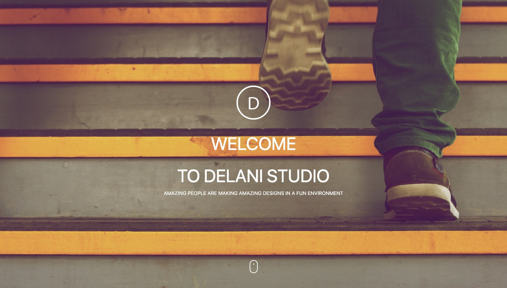
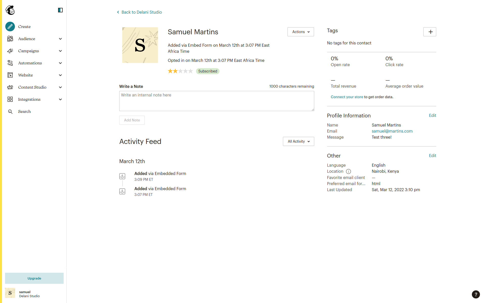

# Delani Studio



### By: Samuel Martins

## Table of Content

-   [Description](#description)
-   [Installation Requirement](#usage)
-   [Technology Used](#technologies)
-   [Licence](#licence)
-   [Authors Info](#author-info)

## Description

This is a simple landing page for a fictional studio. The goal for the project is to test and apply JavaScript animations, DOM manipulation and traversal, and form validation. Visit [live site](https://thesmartcoder7.github.io/DelaniStudio/)

## Behaviour Driven Development 
From the description,this simple landing page is supposed to make it easy for the user to use, navigate, and contact the studio.
* In the case that the user clicks on the services section icons, the descriptions of the corresponding service should be swapped in place of the icon and vice versa.
* In the case that the user hovers over any of the items in the portfolio sectoin, additional description about the portfolio piece should appear as an overlay.
* In the case that the user fills the contact form, they should get a response the their message has been sent and a "Thank you note" for good measure.
* In the case that the user fails to fill any of the fields of the contact form, page should alert them on the missing fields.


Tested Mailchimp Embed working:


## Usage

### Requirements

-   Either a computer, phone, tablet or an Ipad

-   An access to the Internet

### 1. Local Repository

-   Make sure you have a stable internet to have the ability to clone the repository.
-   Type the following command in your terminal to clone this repository

```
git clone https://github.com/thesmartcoder7/DelaniStudio.git
```

If you are using SSH, use the following command

```
git clone git@github.com:thesmartcoder7/DelaniStudio.git
```

When you run the commands successfully, you should have a local version of this repository.

### 2. Online Repository

-   Make sure you have a stable internet for forking this repository.
-   According to the license, you can fork this project. You need to click on the forking icon and it will be added as one of your repositories

Feel free to fork the project and have fun with it. Happy coding!

## Technologies

-   HTML5
-   CSS3
-   JavaScript

## Licence

Copyright (c) Samuel Martins - [MIT Licence](LICENSE)

## Author Info

-   Twitter - [@thesmartcoder7](https://twitter.com/thesmartcoder7)
-   Linkedin - [Samuel Martins](https://www.linkedin.com/in/samuel-martins-09839b115/)
-   Website - [Samuel Martins](https://smart-code.dev)
-   blog - [Samuel Martins](https://samuel-martins.medium.com/)
